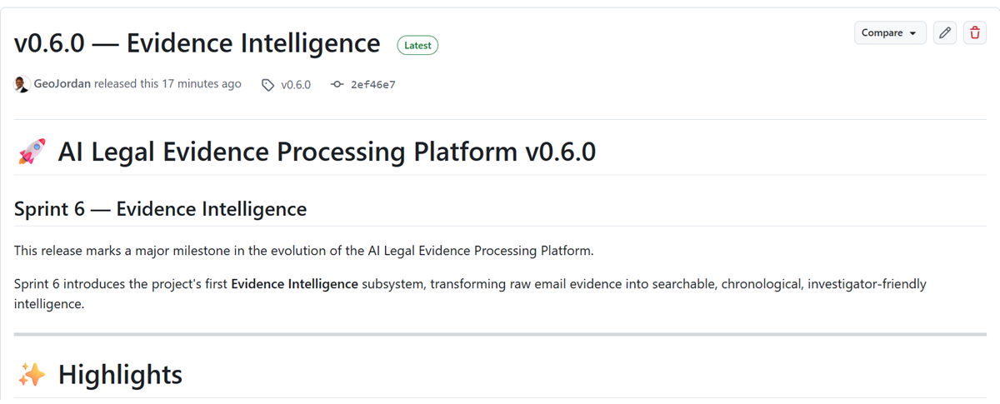
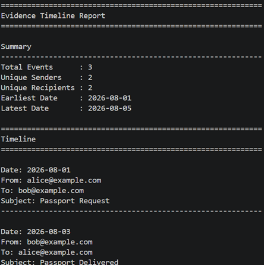
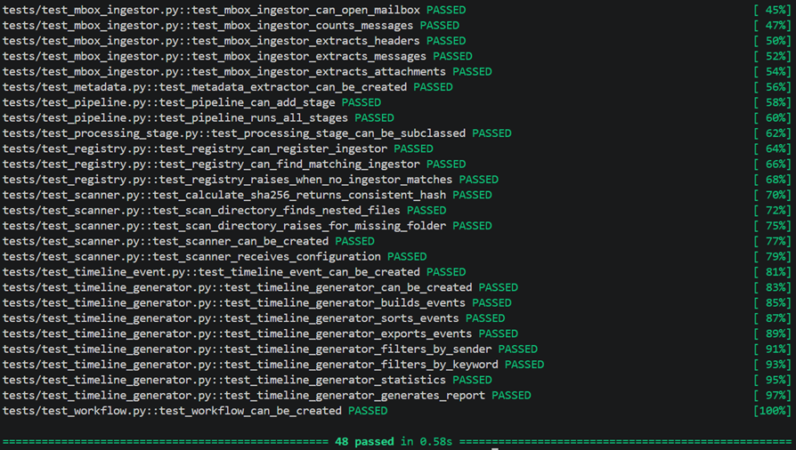
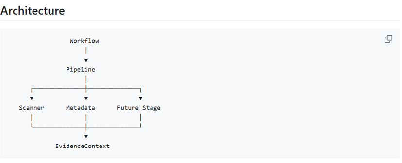

# ⚖️ AI Legal Evidence Processing Platform

### Scan • Extract • Classify • Organize • Prepare Court-Ready Evidence

An extensible Python platform for ingesting, processing, classifying, and preparing digital legal evidence.

Designed for litigation support, family law, civil litigation, internal investigations, eDiscovery, compliance, and digital evidence management.

---


---

## Vision

Legal professionals spend countless hours manually locating, organizing, reviewing, and preparing digital evidence.

This project aims to automate that workflow.

The AI Legal Evidence Processing Platform transforms raw digital evidence into organized, searchable, court-ready evidence through a modular processing pipeline.

Rather than building another file organizer, this project is being engineered as an extensible evidence processing framework capable of supporting multiple evidence sources and future AI-powered analysis.

---

## 🚀 Quick Start

Clone the repository:

```bash
git clone https://github.com/GeoJordan/ai-legal-evidence-processing-platform.git

cd ai-legal-evidence-processing-platform
```

Create a virtual environment:

```bash
python -m venv legal_env
```

Activate it (Windows PowerShell):

```powershell
.\legal_env\Scripts\Activate.ps1
```

Install dependencies:

```bash
pip install -r requirements.txt
```

Run the test suite:

```bash
python -m pytest
```

Current status:

- ✅ Processing Framework
- ✅ Pipeline
- ✅ Evidence Scanner
- 🚧 Evidence Ingestion Framework (in development)

---

## Why This Platform?

Traditional evidence management often requires:

- Manual evidence collection
- Manual email review
- Manual attachment extraction
- Manual exhibit preparation
- Manual timeline creation
- Manual evidence registers

This platform automates these tasks while maintaining a modular architecture that can grow with future capabilities.

---

## Current Features

### Foundation

- Configuration Engine
- Workflow Controller
- Processing Pipeline
- Processing Framework
- Evidence Context
- Metadata Framework

### Evidence Processing

- Evidence Scanner
- File Discovery
- Modular Processing Stages

### Quality

- Unit Tested
- Documentation-Driven Development
- Test-Driven Development (TDD)

---

# 📸 Project Showcase

### GitHub Release (v0.6.0)



---

### Evidence Timeline Report



---

### Automated Test Suite

48 automated tests currently pass.



---

## Architecture



```text
                 Workflow
                     │
                     ▼
                Pipeline
                     │
      ┌──────────────┼──────────────┐
      ▼              ▼              ▼
   Scanner      Metadata      Future Stage
      │              │              │
      └──────────────┼──────────────┘
                     ▼
             EvidenceContext
```

---

## 🛣️ Development Roadmap

| Sprint    | Milestone                 |  Status |
| --------- | ------------------------- | :-----: |
| Sprint 1  | Repository Foundation     |    ✅    |
| Sprint 2  | Configuration & Workflow  |    ✅    |
| Sprint 3  | Evidence Scanner          |    ✅    |
| Sprint 4  | Processing Framework      |    ✅    |
| Sprint 5  | Evidence Ingestion        |    ✅    |
| Sprint 6  | Evidence Intelligence     |    ✅    |
| Sprint 7  | Conversation Intelligence |    🔄   |
| Sprint 8  | AI Classification         | Planned |
| Sprint 9  | Relationship Analysis     | Planned |
| Sprint 10 | Court Package Builder     | Planned |

---

## What Makes This Different?

Unlike traditional file organizers, this project is designed as an extensible processing framework.

Every capability—scanning, metadata extraction, OCR, AI classification, timeline generation, exhibit preparation, and reporting—is implemented as a modular processing stage.

This architecture allows new evidence sources and processing capabilities to be added with minimal changes to the core framework.

---

## Repository Structure

```text
app/
    evidence/
    timeline/
    models/
    configuration.py
    context.py
    metadata.py
    pipeline.py
    scanner.py

config/
docs/
examples/
tests/

README.md
requirements.txt

```
---

## Technology Stack

- Python 3.14
- PyTest
- YAML
- Git
- GitHub
- Test-Driven Development (TDD)
- Modular Architecture

---

## 📈 Project Status

| Item | Value |
|------|-------|
| **Current Version** | **v0.6.0** |
| **Current Sprint** | Sprint 7 |
| **Current Milestone** | Conversation Intelligence |
| **Development Status** | 🟢 Active Development |
| **Architecture** | Modular Processing Framework |
| **Test Framework** | PyTest |
| **Language** | Python 3.14 |

---

## 🚀 Sprint 6 Highlights

Sprint 6 introduced the **Evidence Intelligence** subsystem, enabling intelligent organization, analysis, and reporting of email evidence.

### Implemented

- Evidence Index
- Timeline Generator
- Timeline Report
- Sender Filtering
- Keyword Filtering
- Timeline Statistics
- 48 automated tests
- Architecture Decision Records (ADRs)
- GitHub Release v0.6.0

### Quality

- 48 automated tests passing
- Test-Driven Development (TDD)
- Modular layered architecture
- Architecture Decision Records (ADR)
- Professional project documentation

---

## Example

Generate a professional evidence timeline report.

```bash
python -m examples.generate_timeline_report
```

Example output:


---

## 🔮 Coming Soon

The next development milestones include:

- Conversation Intelligence
- Email conversation threading
- Relationship graph generation
- AI-powered evidence classification
- OCR document processing
- Duplicate evidence detection
- Exhibit package builder
- Court-ready case assembly

---

## Why I Built This

This project was created to explore how software engineering, automation, and artificial intelligence can reduce the manual effort required to process digital legal evidence.

Rather than focusing on a single legal case, the platform is being engineered as a reusable framework capable of supporting multiple evidence sources, extensible processing stages, and future AI-assisted workflows.

---

Built with Python using a modular, test-driven architecture focused on legal evidence automation.
